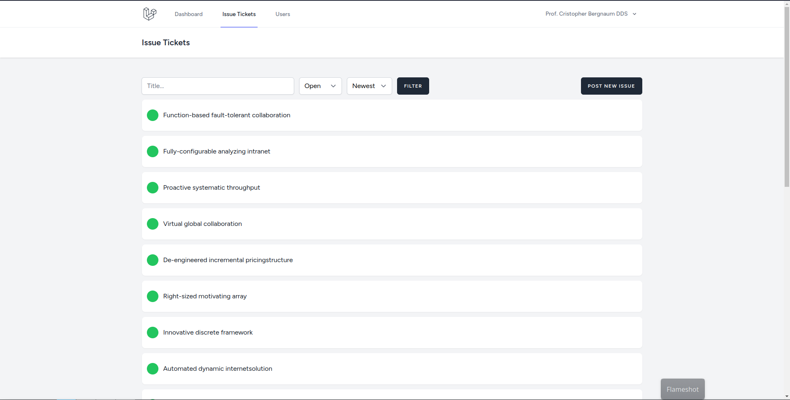
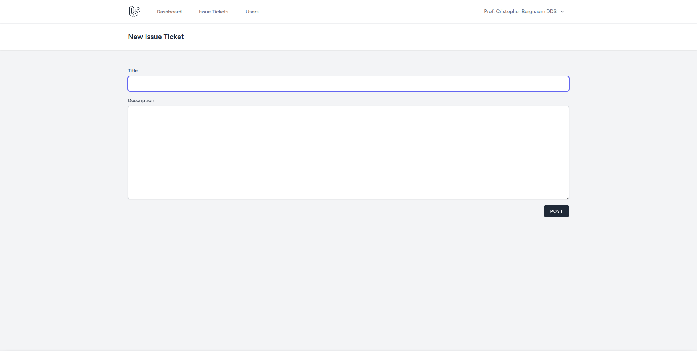
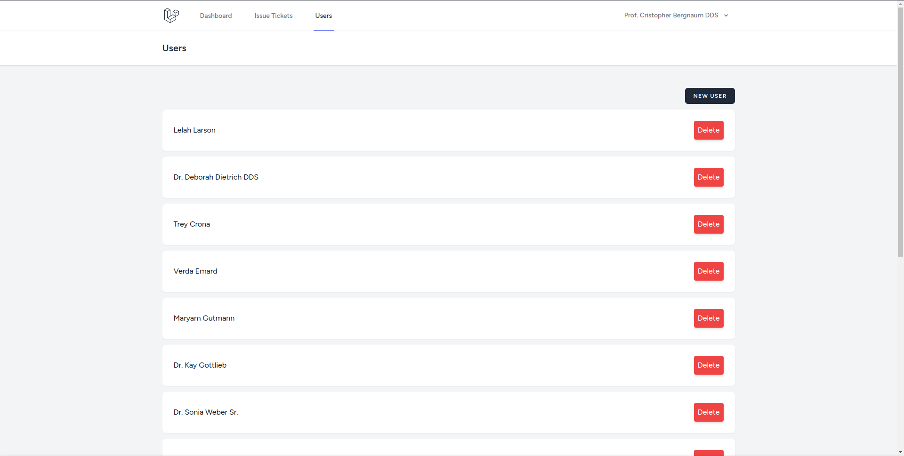
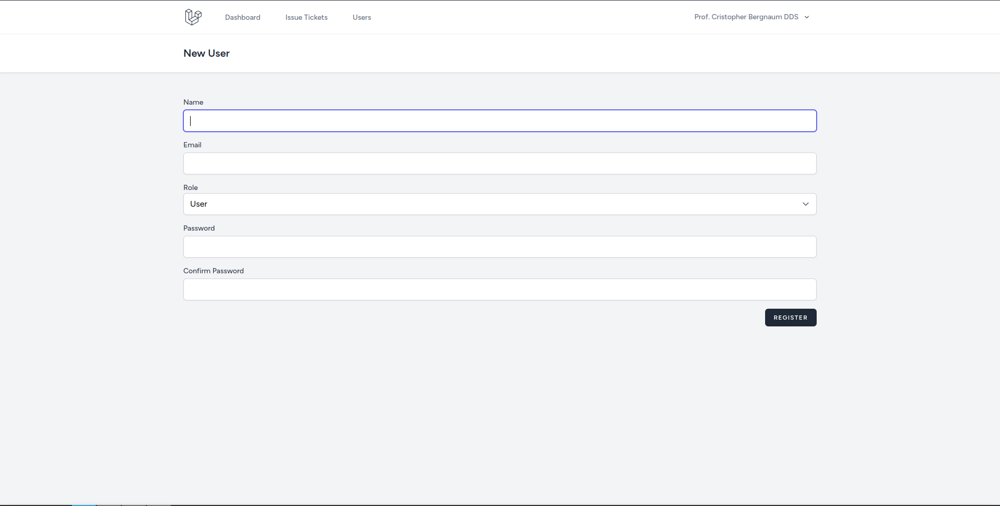

# Objetivo

Criar uma prova de conceito de um BugTracer. Usuários cadastrados podem adicionar tickets de bugs (issues) que também servem como fórum, possibilitando que desenvolvedores e outros usuários comentem sobre o problema. Adminsitradores podem fechar um ticket ou abrir um ticket previamente fechado.

# Instruções de execução

## Variáveis de ambiente

- Copie os conteudos de .env.example para .env
- Adicione as informações do bando de dados
    - O container mysql irá utilizar essas informações para criar seu usuário
    - O endereço da coneção é gerenciado pelo docker-compose
- Adicione seu UID
    - O valor padrão é 1000, e provavelmente não precisa ser alterado
    - Para descobrir seu UID, utilize o comando
 ```
 $ id
 ```
 - A criação da chave de criptografia é gerenciada pelo próprio container

## Execução

O projeto depende de vários containeres externos e de um container com multiplos estágios de criação, todos gerenciados pelo docker-compose. Para executar, utilize o comando

```
$ docker-compose up
```

## Migrations

Se for a primeira vez que estiver executando o projeto, o banco de dados estará vazio e sem as tabelas necessárias, para adicionar as tabelas e popular o banco de dados utilize o comando

```
$ docker-compose exec laravel-app php artisan migrate --seed
```

## Comandos adicionais

Comandos adicionais devem ser direcionados ao container do projeto. Para executar um comando utilize

```
$ docker-compose exec laravel-app <comando>
```

E o docker-compose vai se conectar com o container e executar o comando. 

### Comandos artisan

Comandos artisan são executados da seguinte maneira:

```
$ docker-compose exec laravel-app php artisan <comando>
```

# Rotas

## web

- /tickets

Pagina de listagem de tickets.



- /tickets/create

Pagina de criação de novos tickets.



- /tickets/edit/{ticket}

Pagina de edição de ticket; restrito ao usuário que abriu o ticket.

- /users

Pagina de listagem de usuários; restrito aos administradores.



- /users/create

Pagina de criação de usuário especial para admins, só é possivel criar outros admins por essa página.


